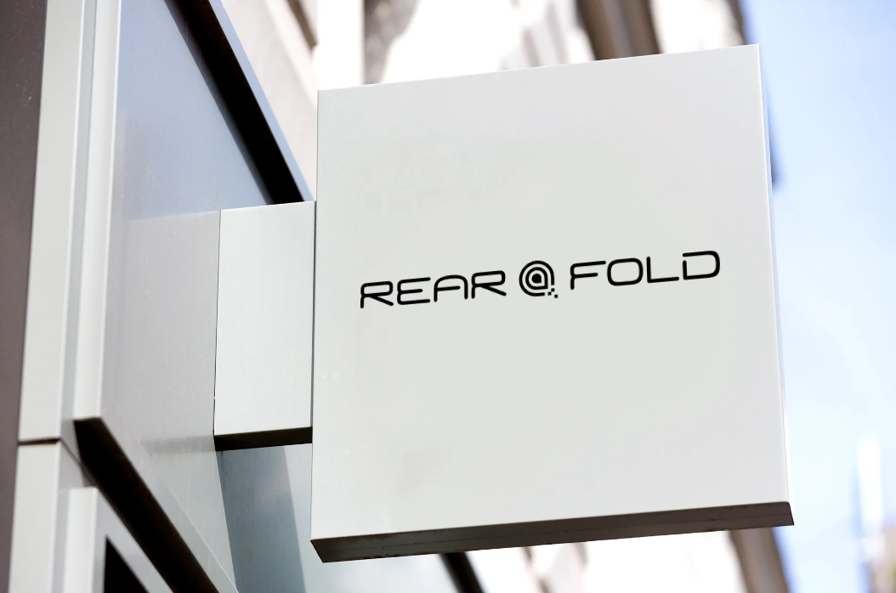

# RearFold-mlops
<h1 align="center">RearFold MLOps</h1>

<p align="center">
  
</p>

<p align="center">
    kaejong2</a><sup>1*</sup> &emsp;&emsp;
    Nega0619</a><sup>2*</sup> &emsp;&emsp;
</p>

<p align="center">
    <a href="https://github.com/snuailab-biz/ison-dev">Demo</a>
</p>

---
## Progress
- [x] 📣 Initialize RFops **highly!**
- [ ] Docker image
- [ ] Release

---
## Install
기본적으로 Docker docker-nvidia는 설치되어 있어야 한다.
```
python -m venv venv
source venv/bin/activate
pip install -r requirements.txt
```
## asdf

